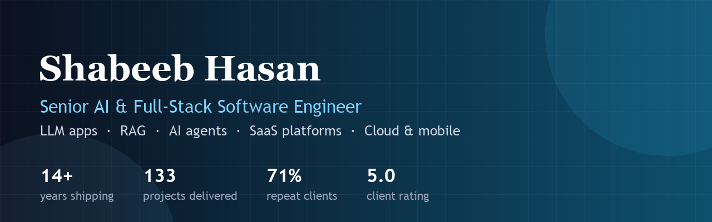

  
  
  
  

## Hi, I'm Shabeeb

I build AI systems and full-stack products that go into production and stay there. Fourteen years in, 133 delivered projects, and the number I am proudest of: 71% of my work comes from clients who hired me again. One platform company came back 21 separate times, and my longest single engagement ran six years.

I own the whole system. Backend, frontend, database, integrations, and the ML or LLM logic, designed around how the business actually runs rather than around the framework of the month.

**Currently working on:** LLM application runtimes, RAG systems that answer from real documents, agent tooling on MCP servers, and behavioural AI research for a PhD at the University of Karachi.

## What I build

| | |
|---|---|
| **AI applications** | LLM apps, RAG chatbots over business documents, agent workflows with human approval gates, MCP server tooling |
| **Machine learning** | Computer vision (YOLO, OpenCV), OCR pipelines, behavioural signal models, production inference services |
| **SaaS platforms** | Multi-tenant products end to end: schema, API, payments, dashboards, deployment |
| **Cloud and data** | Serverless pipelines on AWS Lambda, media processing, ETL, auto-scaling workers |
| **Mobile** | React Native with native iOS and Android modules, offline sync, on-device processing |

## Tech I reach for

## Selected work

Full write-ups with the decisions and trade-offs live at [shabeeb.baydot.net/case-studies](https://shabeeb.baydot.net/case-studies/).

- **[Franco-fun referral rewards platform](https://shabeeb.baydot.net/case-studies/francofun-referral-rewards-platform/)** is a live SaaS I built solo, from schema to deployment. React 18, Django 5, PostgreSQL, Stripe.
- **[Serverless video pipeline](https://shabeeb.baydot.net/case-studies/serverless-video-pipeline-ffmpeg-aws-lambda/)** runs FFmpeg encoding on AWS Lambda with an EC2 overflow tier. Seven contracts with the same client across five years.
- **[OCR and document intelligence](https://shabeeb.baydot.net/case-studies/ocr-document-intelligence-pipeline/)** blends Tesseract and Cloud Vision, with low-confidence documents routed to a human. One pipeline stayed in production for six years.
- **[Django at scale](https://shabeeb.baydot.net/case-studies/django-at-scale-21-contracts/)** covers 21 separate product contracts for one platform company between 2019 and 2025.
- **[Behavioural AI authentication](https://shabeeb.baydot.net/case-studies/behavioral-ai-authentication-mobile-sensor-signals/)** is phone-sensor continuous authentication, measured honestly rather than marketed.

## Writing

I write about the engineering decisions behind this work, not the hype around it.

- [Why 71% of my clients come back](https://shabeeb.baydot.net/blog/why-71-percent-of-my-clients-come-back-freelance-delivery-system/)
- [Continuous authentication with phone sensors, what actually works](https://shabeeb.baydot.net/blog/continuous-authentication-with-phone-sensors-what-actually-works/)
- [How to build a RAG chatbot for business documents](https://shabeeb.baydot.net/blog/how-to-build-a-rag-chatbot-for-business-documents/)
- [More on the blog](https://shabeeb.baydot.net/blog/)

## GitHub activity

  
  

## Working together

I take on AI application work, backend and platform builds, and the awkward projects where an existing system needs someone to take real ownership of it.

**[Book a call](https://calendly.com/shabeebhasan/meeting-with-shabeeb-hasan)** or email **shabeebhasan@gmail.com**. Based in Karachi, Pakistan (UTC+5), working with teams across the US, Europe, Australia and the Gulf.
